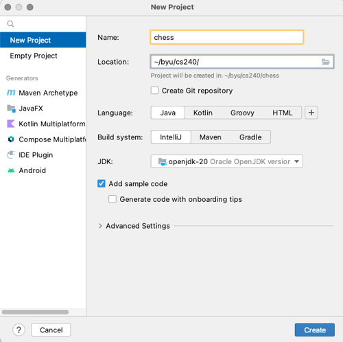

# Chess Game - Getting Started

♟️ [Chess Application Overview](../chess.md)

📋 [Phase 1 Requirements](chess-game.md)

📁 [Phase 1 Starter code](starter-code)

Take the following steps to setup your Chess project.

## Setting up your GitHub repository

1. Create a GitHub repo for your chess project and name it `chess`.
1. Clone the repository to your development environment. Make sure you put the clone of the repository in a directory that you use for this class's coursework. These commands will look something like the following.
   ```sh
   cd ~/byu/cs240
   git clone https://github.com/YOURACCOUNTHERE/chess.git
   ```

## Creating an IntelliJ Project

1. Open IntelliJ and create your project. All of chess phases will use this same project.
1. File -> New -> Project
1. Name your project `chess`.
1. Point the location of the project to be the directory that contains your git repository. With the name of `chess` and location set to the directory containing your repo, your IntelliJ project should be created in your git repository directory.
   
1. Do _not_ select the option to create a Git repository since you already have done that by cloning from GitHub.
1. Select `Java` and press `Create`.
1. Right Click on `src` and select `Mark Directory as`->`Unmark as Sources Root`.
1. In the `src` folder, create a subfolder named `main`. Right-click on `main` and select `Mark Directory as`->`Mark as Sources Root`. This folder will contain your chess game Java source code.
1. In the `src` folder, create a subfolder named `starter`. Right-click on `starter` and select `Mark Directory as`->`Mark as Sources Root`. This folder will contain the starter Java code that we provide to you.
1. In the `src` folder, create a subfolder named `test`. Right-click on `test` and select `Mark Directory as`->`Mark as Test Sources Root`. This folder will contain all Junit test cases, including the pass off test cases.
1. In a File Explorer (outside of IntelliJ), copy the `chess` folder from the provided [starter code](starter-code) into the `src/starter` folder.
1. In a File Explorer (outside of IntelliJ), copy the `passoffTests` folder from the provided [starter code](starter-code) into the `src/test` folder.

## Adding Dependencies

`Dependencies` are external libraries that are used in your application. Java libraries are contained in JAR files (.jar). Maven provides an online repository of freely available Java libraries that you can include in your projects. You can go to [https://mvnrepository.com/](https://mvnrepository.com/) to browse all the libraries available through Maven. This section explains how to use Maven to add an external library dependency to your project. Regarding the versions of all dependencies throughout this project, there likely will be newer versions available. You are welcome to use the versions listed below (which are the newest at the time of writing) or the most current ones.

1. Go to File -> Project Structure
1. In the pop-up go Modules -> Dependencies, and hit the `+` mark to add new dependency
1. Pick Library -> From Maven
1. In the resulting text box you can type the name of the library you want to add. If you know part of a dependency you can click the search button to look for matching dependencies. Add your dependency and click OK.
1. In the pop-up box you can just hit OK

### Dependencies Needed for Chess Game

- org.junit.jupiter:junit-jupiter:5.9.2
  - Scope: Test

After adding this dependency there should no longer be any red lines on any of the file names.
